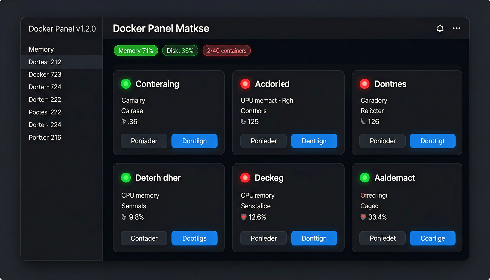

# Docker Management Panel

A lightweight Docker management panel for Synology NAS, built with FastAPI.

## Features

- 🐳 View all Docker containers with real-time stats (CPU, memory, network)
- 🎮 Start/Stop/Restart containers with per-card independent controls
- 📊 System monitoring (memory, disk usage)
- 🎨 4 color themes (Dark, Light, Ocean Blue, Purple Night)
- 📱 Mobile responsive design
- 🔄 Auto-refresh every 30 seconds

## Tech Stack

- **Backend**: FastAPI (Python)
- **Frontend**: Vanilla HTML/CSS/JS (embedded)
- **Docker API**: Unix socket direct access

## Deployment

### Direct Python (recommended for Synology)

```bash
pip install fastapi uvicorn pydantic
python3 -c "import uvicorn; from main import app; uvicorn.run(app, host='0.0.0.0', port=50088, workers=1)"
```

### Docker

```bash
docker build -t docker-panel .
docker run -d -p 50087:50087 -v /var/run/docker.sock:/var/run/docker.sock docker-panel
```

## API Endpoints

| Endpoint | Method | Description |
|----------|--------|-------------|
| `/` | GET | Frontend (HTML) |
| `/api/containers` | GET | List all containers |
| `/api/containers/all-stats` | GET | All containers with stats |
| `/api/container/{id}/stats` | GET | Single container stats |
| `/api/container/{id}/action` | POST | Start/Stop/Restart |
| `/api/system` | GET | System info (memory, disk) |

## Screenshot


